  

 

  <h1>Hi 👋, I'm Umar Anayat</h1>
  <h3>A Passionate Software Engineer from Pakistan</h3>
  
<strong>Flutter Developer | 2+ Years | Dart & Firebase Expert</strong>

  

---

### About Me
- 🔭 I’m currently working on **Dart & Flutter Projects** (Educational Apps, E-commerce)
- 🌱 I’m currently learning **Advanced Flutter, Bloc, Riverpod, Firebase Analytics**
- 💬 Ask me about **Flutter, Dart, Firebase, State Management, App Publishing**
- 📫 How to reach me: **geniusumar08@gmail.com**
- ⚡ Fun fact: **I am funny** 😄

---

### Connect with Me

  
  
  

---

### Languages and Tools

  
  
  
  
  
  
  

---

### Support Me

  

---
### GitHub Stats (Live Auto-Updating)

  
  

  

---

### Contribution Snake (Auto-Generated)

  

---

  <i>"Code never lies. Flutter makes it fly."</i>

